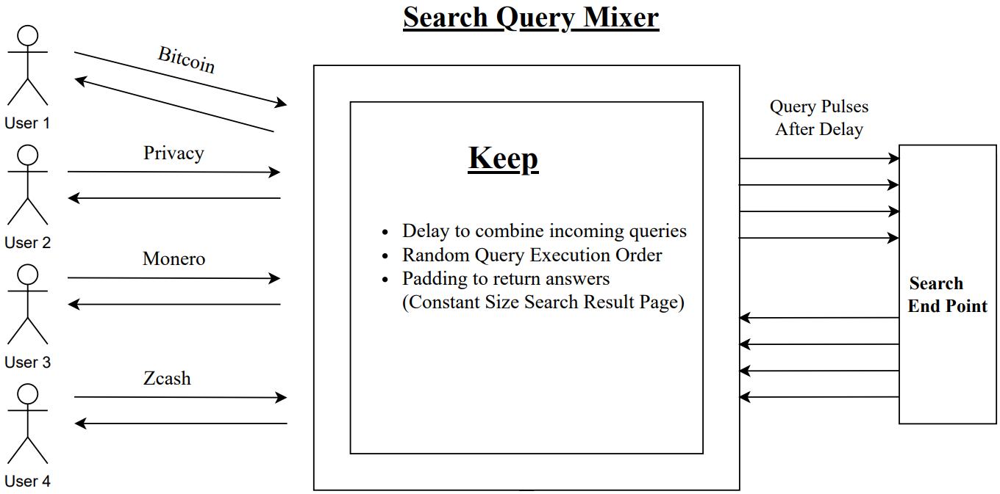
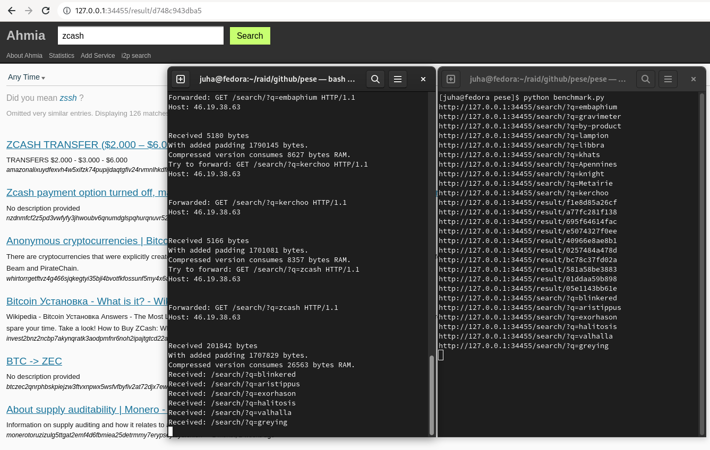

Privacy Extension for Search Engines (PESE)
---------------------------------------

Decouples users' IP addresses from the search phrases they enter even from the root user.

{width=75%}

Privacy Extension for Search Engines (PESE) is a search engine add-on that is incliened to improve anonymity of the user web search queries.
It decouples users' IP addresses from the search phrases they enter.
The idea is to aggregate search queries within an enclave and 
execute them in a random sequence after a brief delay.
Thus, the search engine cannot see who specifically searched for particular terms.
Even if the delay is only 100 milliseconds in a real-world scenario,
this would result in a large anonymity set,
such as 1,000 individuals mixed together.

{width=75%}

# Requirements

PESE is mainly built to run on Trusted Execution Environment (TEE) Platforms with Enarx.

**Hardware:** _AMD SEV-SNP, Intel SGX_

**Environment:** _Rust, Enarx_

# Installation guide for Rust and Enarx

**Rust Installation:**

(For macOS, Linux, or another Unix-like OS)

`curl --proto '=https' --tlsv1.2 -sSf https://sh.rustup.rs | sh`

Detailed [Rust Installation](https://www.rust-lang.org/tools/install) guide

**Enarx Installation:**

Installation via RPM Package on Fedora, CentOS, or RHEL.

`sudo yum install -y --nogpgcheck https://github.com/enarx/enarx/releases/download/v0.6.4/enarx-0.6.4-1.x86_64.rpm`

Installation via DPKG package on Ubuntu or Debian systems.

```
wget https://github.com/enarx/enarx/releases/download/v0.6.4/enarx-0.6.4-1_amd64.deb
sudo dpkg -i enarx-0.6.4-1_amd64.deb
```

Detailed Quick [Enarx Installation](https://enarx.dev/docs/Quickstart) guide.

# Execution

The execution of all the processes and code can be initiate from single file.

```sh
bash launch.sh
```

For manual execution, following commands can be run inside _"pese"_ directory

```
cargo build --release --target=wasm32-wasi
enarx run --backend=nil --wasmcfgfile Enarx.toml target/wasm32-wasi/release/pese.wasm
```

# Test query

For testing, a query can be send via curl request.

```sh
curl "http://127.0.0.1:34455/search/?q=zcash"
```

# Action

1. PESE server starts and combines search queries inside TEE instance.
2. PESE executes all the queries in random order and returns the results after a delay.

# Limitations(Under development)

Currently, PESE is not using SSL/TLS.
A user cannot attestate the TEE Keep.
